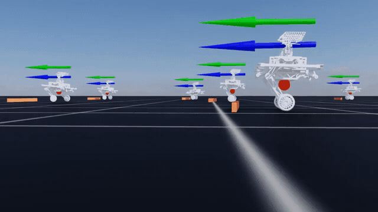
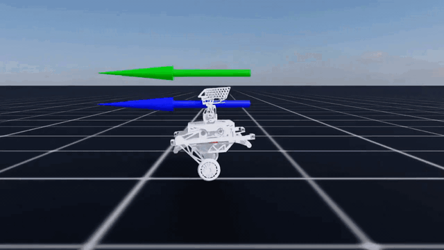
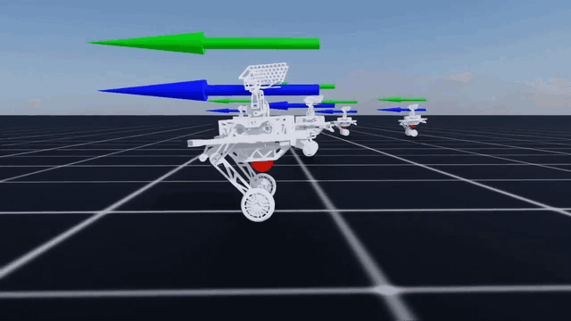
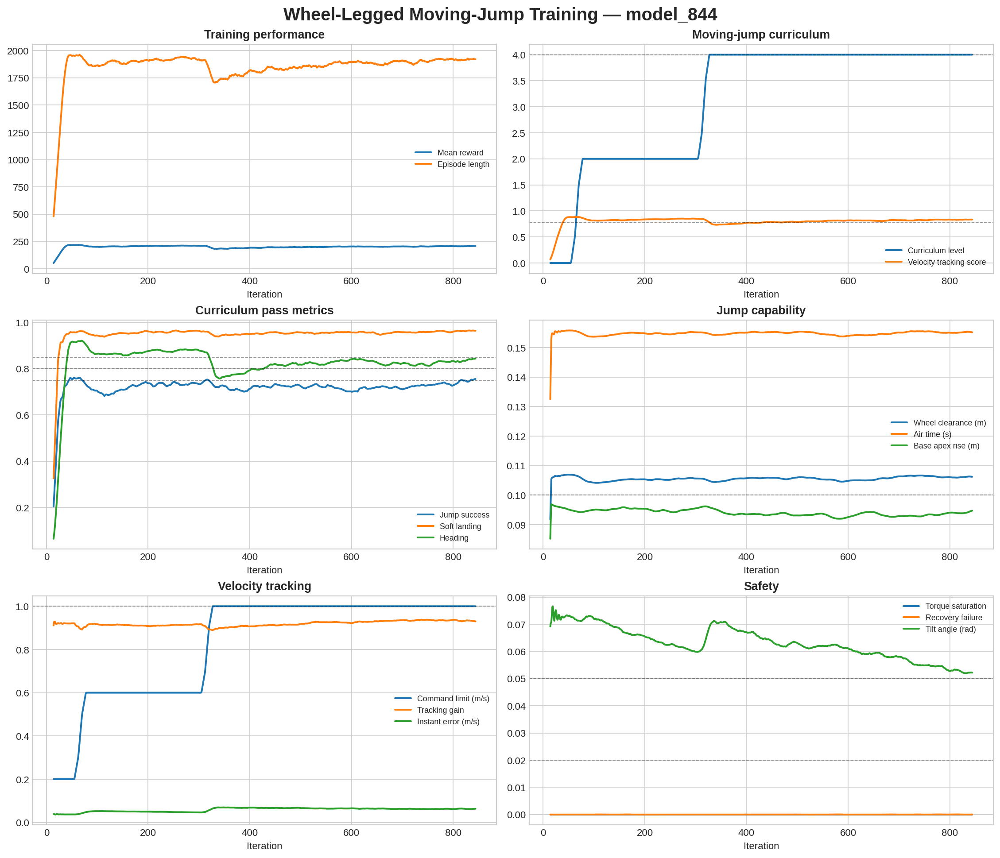

# Wheel-Legged Robot Learning

基于 NVIDIA Isaac Lab 的开链轮腿平衡机器人强化学习项目，包含平移、旋转、原地跳跃、高跳落地、轮端收腿净空，以及边移动边跳跃等任务。

> 这是一个以学习、复现和交流为主要目标的个人项目。作者目前也处于强化学习与机器人控制的入门学习阶段，代码和训练方案难免存在不足。欢迎大家通过 Issue、Discussion 或 Pull Request 一起分析问题、交流经验并完善项目。希望这份从“先站稳、再移动、再跳起来”逐步迭代的记录，能为同样在学习 Isaac Lab 和机器人强化学习的朋友提供一些参考。

## 项目简介

本项目面向一台两腿、两轮的开链轮腿机器人。机器人需要在欠驱动条件下保持机身平衡，并根据速度、高度和跳跃命令完成运动。

项目采用 Isaac Lab 的 Manager-Based 环境组织方式，以 RSL-RL PPO 为主要训练后端，并在腿部控制中加入虚拟模型控制（VMC）。相比直接输出六个关节目标，策略输出左右虚拟腿角、虚拟腿长和轮速参考，再由 VMC 转换为实际关节力矩。

当前已经实现：

- 平地自平衡；
- 前进、后退与航向控制；
- 机身高度调节；
- 速度与航向课程学习；
- 外部命令触发的六阶段跳跃状态机；
- 原地小跳、高跳与落地吸能；
- 空中收腿，提高轮端真实净空；
- 移动过程中起跳、落地并恢复速度；
- `0.2 → 0.4 → 0.6 → 0.8 → 1.0 m/s` 移动跳跃课程；
- 平地模型到跳跃模型的观测维度迁移；
- 按训练指标自动切换任务的一键分阶段训练；
- Play 调试指标输出与键盘自由控制；
- 无动力落地后的 VMC 力矩渐入、缓慢伸腿和策略平滑接管测试；
- 跳跃开环物理能力测试。

本项目仍是研究与学习性质的仿真工程，尚未完成真实机器人部署和系统性的 Sim-to-Real 验证。

## 演示、预训练模型与训练曲线

### 最新效果：跨越 7 cm 高障碍物

最新 Oracle 障碍物策略跨越 **7 cm 高实体障碍物**的仿真效果：



[查看高清 MP4 视频](docs/media/obstacle_jump_7cm.mp4)

### 移动跳跃策略演示

以下演示均使用最终移动跳跃策略 `model_844.pt`：

### 单环境测试

单台机器人执行移动、转向和跳跃：



### 多环境测试

多个并行环境中的策略表现：



### 键盘控制

使用键盘实时控制移动、转向和跳跃：


GIF 会在 GitHub README 中直接循环播放。高清版本可单独下载：
[单环境 MP4](docs/media/single_env_demo.mp4) ·
[多环境 MP4](docs/media/multi_env_demo.mp4) ·
[键盘控制 MP4](docs/media/keyboard_control_demo.mp4)

预训练 checkpoint：

```text
checkpoints/wheel_legged_moving_jump_model_844.pt
```

- 对应环境：`Wheel-Legged-Jump-Moving-Curriculum-Flat-v0`
- 课程终点：`1.0 m/s` 平移速度、`1.2 rad/s` yaw 命令范围
- SHA-256：`d1d271f0c323fa13538b80119839b29eb267942af63a6e0d6c3dbf5ef319deb0`

直接运行预训练策略：

```bash
"${ISAACLAB_ROOT}/isaaclab.sh" -p scripts/rsl_rl/play.py \
  --task Wheel-Legged-Jump-Moving-Curriculum-Flat-v0 \
  --checkpoint checkpoints/wheel_legged_moving_jump_model_844.pt \
  --num_envs 1 \
  --command_range 1.0 \
  --yaw_command_range 1.2 \
  --jump_height 0.10
```

最终阶段的 TensorBoard 曲线由原始 event 文件自动导出：



原始 TensorBoard event 已保存在 `docs/tensorboard/model_844/`，可以重新
交互式查看：

```bash
tensorboard --logdir docs/tensorboard/model_844 --port 6006
```

如需从其他训练日志自动生成相同格式的静态图：

```bash
python scripts/plot_tensorboard_curves.py \
  /path/to/events.out.tfevents.* \
  --output training_curves.png \
  --title "Wheel-Legged Training"
```

曲线和视频来自本项目当前 checkpoint 的单次训练与 Play，主要用于复现
和展示，不代表多随机种子的统计置信区间。

## 训练路线

项目没有把所有能力一次性塞进同一个奖励函数，而是逐步增加难度：

```text
平移与旋转
Wheel-Legged-Flat-v0
        │
        ▼
基础原地跳跃
Wheel-Legged-Jump-Flat-v0
        │
        ▼
高跳与落地强化
Wheel-Legged-Jump-High-Landing-Flat-v0
        │
        ▼
轮端收腿与净空强化
Wheel-Legged-Jump-Clearance-Flat-v0
        │
        ▼
移动跳跃课程
Wheel-Legged-Jump-Moving-Curriculum-Flat-v0
```

最后得到的是一个带普通移动样本和跳跃样本的统一策略，而不是在移动策略与跳跃策略之间硬切换。

## 可用环境

| 环境 ID | 主要用途 |
|---|---|
| `Wheel-Legged-Flat-v0` | 平地平衡、速度跟踪、高度和航向控制 |
| `Wheel-Legged-Jump-Flat-v0` | 基础原地跳跃与六阶段状态机 |
| `Wheel-Legged-Jump-High-Landing-Flat-v0` | `0.09–0.12 m` 高跳、预伸腿和落地吸能 |
| `Wheel-Legged-Jump-Clearance-Flat-v0` | 空中收腿和 `0.08–0.12 m` 轮端净空 |
| `Wheel-Legged-Jump-Moving-Flat-v0` | 第一档低速移动跳跃 |
| `Wheel-Legged-Jump-Moving-Curriculum-Flat-v0` | 从 `0.2 m/s` 自动训练到 `1.0 m/s` 的移动跳跃 |
| `Wheel-Legged-Jump-Target-Landing-Flat-v0` | 根据速度解算目标落点并训练落点精度 |
| `Wheel-Legged-Jump-Obstacle-Oracle-Flat-v0` | 使用仿真真值触发的实体障碍物课程 |
| `Wheel-Legged-Jump-Obstacle-Perceptive-Flat-v0` | 使用前向深度感知触发障碍物跳跃 |

## 项目结构

```text
Wheel-Legged-Lab/
├── source/wheel_legged_robot/
│   └── wheel_legged_robot/tasks/manager_based/wheel_legged_robot/
│       ├── agents/                  # PPO 配置
│       ├── assets/                  # 机器人资产配置
│       ├── mdp/
│       │   ├── actions.py           # VMC 动作与力矩映射
│       │   ├── commonds.py          # 速度、高度和航向命令
│       │   ├── curriculums.py       # 移动与移动跳跃课程
│       │   ├── events.py            # 随机化与重置事件
│       │   ├── jump.py              # 跳跃命令、观测和奖励
│       │   ├── power_on.py          # 上电站立与策略交接状态机
│       │   ├── observations.py      # 观测项
│       │   └── rewards.py           # 平衡与移动奖励
│       ├── wheel_legged_flat_env_cfg.py
│       └── wheel_legged_jump_env_cfg.py
├── scripts/
│   ├── rsl_rl/
│   │   ├── train.py                 # RSL-RL 训练
│   │   ├── play.py                  # 模型评估与键盘控制
│   │   ├── train_staged.sh          # 一键分阶段训练入口
│   │   └── staged_training_config.json
│   ├── expand_rsl_checkpoint_for_jump.py
│   ├── power_on_stand_open_loop_test.py
│   └── jump_open_loop_test.py
├── POWER_ON_STAND_TEST.md
├── JUMP_OPEN_LOOP_TEST_AND_TRAINING_PLAN.md
├── JUMP_TASK_DESIGN.md
└── STAGED_TRAINING.md
```

## 依赖

### 已验证的开发环境

| 组件 | 版本 |
|---|---|
| 操作系统 | Linux | Ubuntu22.04
| Python | 3.11 |
| NVIDIA Isaac Sim | 5.1.0 |
| Isaac Lab | 2.3.2 |
| PyTorch | 2.7.0 + CUDA 12.8 |
| RSL-RL | 5.0.1 |
| Gymnasium | 1.3.0 |

以上是当前开发机器上的版本记录，不代表其他版本一定不可使用。Isaac Sim、Isaac Lab、PyTorch 和 CUDA 的兼容关系变化较快，建议优先按照 [Isaac Lab 官方安装文档](https://isaac-sim.github.io/IsaacLab/main/source/setup/installation/index.html) 创建环境。

### 硬件建议

- 支持 CUDA 的 NVIDIA GPU；
- 默认训练使用 `4096` 个并行环境；
- 显存不足时可先将 `--num_envs` 调低至 `512`、`1024` 或 `2048`；
- Play 和功能验证通常只需要 `1–50` 个环境。

### 机器人模型资产

机器人 URDF 和 STL 已放在扩展内部：

```text
source/wheel_legged_robot/wheel_legged_robot/tasks/manager_based/
└── wheel_legged_robot/assets/wheellegged_description/
```

代码通过相对于 Python 包的路径加载模型，不再依赖本地 `robot_lab` 数据目录。机器人模型来自 [clearlab-sustech/Wheel-Legged-Gym](https://github.com/clearlab-sustech/Wheel-Legged-Gym/tree/master/resources/robots/wl)，按上游 BSD 3-Clause 许可证再分发。`wl_dealed.urdf` 在原模型基础上把腿杆碰撞 mesh 替换为 box，以提高仿真稳定性和效率。具体来源、修改和许可证见[资产许可说明](source/wheel_legged_robot/wheel_legged_robot/tasks/manager_based/wheel_legged_robot/assets/wheellegged_description/ASSET_LICENSE.md)。

## 安装

### 1. 安装 Isaac Lab

先按照官方文档安装 Isaac Sim 和 Isaac Lab，并确认下面的命令能够正常运行：

```bash
export ISAACLAB_ROOT=/absolute/path/to/IsaacLab
"${ISAACLAB_ROOT}/isaaclab.sh" -p -c "import isaaclab; print('Isaac Lab is ready')"
```

如果使用 Conda，请先激活安装 Isaac Lab 的环境：

```bash
conda activate env_isaaclab
```

### 2. 克隆项目

克隆本仓库：

```bash
git clone https://github.com/zyicome/Wheel-Legged-Lab.git
cd Wheel-Legged-Lab
```

### 3. 安装扩展

```bash
"${ISAACLAB_ROOT}/isaaclab.sh" -p -m pip install -e source/wheel_legged_robot
```

列出已注册环境：

```bash
"${ISAACLAB_ROOT}/isaaclab.sh" -p scripts/list_envs.py
```

如果可以看到以 `Wheel-Legged-` 开头的环境，说明 Python 扩展已经成功安装。

## 快速开始

以下命令均假设当前目录是项目根目录，并且已经设置：

```bash
export ISAACLAB_ROOT="/absolute/path/to/IsaacLab"
```

### 训练平地移动策略

```bash
"${ISAACLAB_ROOT}/isaaclab.sh" -p scripts/rsl_rl/train.py \
  --task Wheel-Legged-Flat-v0 \
  --headless \
  --num_envs 4096 \
  --run_name flat_baseline
```

训练输出保存在：

```text
logs/rsl_rl/wheel_legged_flat/<timestamp>_<run_name>/
```

### 训练防摔恢复与复杂地形策略

复杂地形控制仍然是命令条件策略：键盘或上层控制器提供 `vx`、`wz` 和机身
高度，策略结合 IMU、关节、轮速等状态决定怎样稳定执行。它不会自行选择路线，
因此加入地形感知不等于加入自主导航。

推荐先从合格的平地 checkpoint 训练可恢复范围内的失衡和推撞：

```bash
"${ISAACLAB_ROOT}/isaaclab.sh" -p scripts/rsl_rl/train.py \
  --task Wheel-Legged-Recovery-Flat-v0 \
  --headless \
  --num_envs 4096 \
  --load_checkpoint_path /absolute/path/to/flat/model_xxx.pt \
  --load_weights_only \
  --run_name recovery
```

该任务覆盖约 `roll ±0.22 rad`、`pitch ±0.28 rad` 的初始失衡和周期性推撞，
但不训练完全侧躺起立。`recovery_success_rate` 表示一次 reset/推撞后在 2.5 秒
内重新达到姿态、高度和连续稳定时间要求的比例；它不是普通站立帧占比。

随后训练不依赖前视传感器的反应式复杂地形策略：

```bash
"${ISAACLAB_ROOT}/isaaclab.sh" -p scripts/rsl_rl/train.py \
  --task Wheel-Legged-Terrain-Reactive-v0 \
  --headless \
  --num_envs 4096 \
  --load_checkpoint_path /absolute/path/to/recovery/model_xxx.pt \
  --load_weights_only \
  --run_name terrain_reactive
```

该课程混合缓坡、1.5–4.5 cm 阶梯和 0–3.5 cm 粗糙地面。档位根据一整个
episode 内“沿命令方向实际行驶距离 / 命令要求距离”升降，前进后再后退不会
因世界坐标净位移抵消而误判。

如果实机计划安装深度相机、激光雷达或 ToF，可选用感知版。Actor 在相同本体
观测后增加 `5 × 3 = 15` 个局部高度点（前方五个距离、左右三条扫描线）；
`--load_weights_only` 会自动扩展旧 checkpoint 的输入层：

```bash
"${ISAACLAB_ROOT}/isaaclab.sh" -p scripts/rsl_rl/train.py \
  --task Wheel-Legged-Terrain-Perceptive-v0 \
  --headless \
  --num_envs 4096 \
  --load_checkpoint_path /absolute/path/to/terrain_reactive/model_xxx.pt \
  --load_weights_only \
  --run_name terrain_perceptive
```

实机部署时必须由真实传感器生成同样顺序和尺度的 15 维局部高度，不能直接依赖
仿真真值。完整侧躺、趴倒或后仰后的起立应先验证机械行程和扭矩可行性，再作为
独立 Recovery/Self-righting 策略训练，不与正常移动动作直接混合。

当前一键流水线把 Reactive 地形能力作为 Jump Flat 的初始化，但后续跳跃阶段
仍在平地训练，因此最终障碍物 checkpoint 不等价于“复杂地形移动跳跃模型”，
也可能发生部分地形能力遗忘。若要把两者合并，应在地形移动稳定后新增独立的
Jump-Terrain 联合微调阶段，并混入一定比例平地样本，而不是直接用 Perceptive
checkpoint 加载现有 48 维跳跃任务。

### 单独训练一个跳跃阶段

不同跳跃任务的观测维度一致，可以使用上一阶段 checkpoint 只迁移网络权重：

```bash
"${ISAACLAB_ROOT}/isaaclab.sh" -p scripts/rsl_rl/train.py \
  --task Wheel-Legged-Jump-High-Landing-Flat-v0 \
  --headless \
  --num_envs 4096 \
  --load_checkpoint_path /absolute/path/to/previous/model_700.pt \
  --load_weights_only \
  --run_name high_landing
```

不要把未经转换的平地 checkpoint 直接加载到跳跃任务。平地策略缺少跳跃观测，需要先使用 `scripts/expand_rsl_checkpoint_for_jump.py` 扩展首层网络和归一化器。

### 训练目标落点阶段

`Wheel-Legged-Jump-Target-Landing-Flat-v0` 在现有 8–12 cm 移动跳跃能力上
加入与速度一致的目标落点。触发跳跃时按照
`target_distance = vx_command × 0.16 s × U(0.9, 1.1)` 锁存带符号距离，并
限制在 `[-0.16, 0.16] m`；因此前进命令对应前方落点，后退命令对应后方落点。
目标点以起跳瞬间的位置和机头方向定义，不会退化成只沿世界 X 轴跳跃。训练覆盖
`vx ∈ [-1, 1] m/s` 和最大 `wz ∈ [-1.2, 1.2] rad/s`。该任务仍使用原来的
48 维跳跃观测，可以直接迁移最终移动跳跃 checkpoint：

```bash
"${ISAACLAB_ROOT}/isaaclab.sh" -p scripts/rsl_rl/train.py \
  --task Wheel-Legged-Jump-Target-Landing-Flat-v0 \
  --headless \
  --num_envs 4096 \
  --load_checkpoint_path checkpoints/wheel_legged_moving_jump_model_844.pt \
  --load_weights_only \
  --run_name target_landing
```

训练时重点观察 `J落点误差` 和 `J落点成功`。默认成功条件是首次触地位置与目标
二维距离不超过 0.05 m，同时仍需满足原有的起跳高度、轮端净空、滞空、柔和
落地、速度恢复和姿态恢复条件。固定 0.10 m 落点进行 Play：

```bash
"${ISAACLAB_ROOT}/isaaclab.sh" -p scripts/rsl_rl/play.py \
  --task Wheel-Legged-Jump-Target-Landing-Flat-v0 \
  --checkpoint /absolute/path/to/target_landing/model_1000.pt \
  --num_envs 10 \
  --command_range 1.0 \
  --yaw_command_range 1.2 \
  --jump_height 0.10 \
  --jump_distance 0.10
```

### 训练 Oracle 障碍物阶段

`Wheel-Legged-Jump-Obstacle-Oracle-Flat-v0` 在每个环境中放置一个横跨行驶
方向的刚性障碍物。环境根据障碍物距离和当前速度解析计算触发时机：

```text
target_distance  = clamp(|vx_command| × 0.18 s, 0.08 m, 0.16 m)
takeoff_standoff = clamp(target_distance - obstacle_width - 0.02 m,
                         0.02 m, 0.07 m)
trigger_distance = |vx_command| × 0.44 s + takeoff_standoff
```

落点距离以实测约 `0.18 s` 滞空时间为依据，不再随触发后的剩余障碍物距离增长。
这样即使策略在蹲伏或蹬伸阶段暂时减速，也不会得到 `0.25–0.30 m` 这类不可达
落点。触发位置同时根据障碍物宽度调整，使速度目标、起跳位置和障碍物几何保持
物理一致。

策略在原 48 维跳跃输入后增加 10 维机器人前向高度扫描。训练脚本在从旧的
目标落点 checkpoint 迁移时会自动扩展 actor/critic 的第一层输入，新增列保持
随机初始化，其余权重原样加载。

当前障碍物几何课程细分为 7 档；每档高度表示随机暴露高度的上限：

| `O档` | 高度上限 | 宽度 | 前进速度范围 |
|---:|---:|---:|---:|
| 0 | 0.02 m | 0.035 m | 0.45–0.60 m/s |
| 1 | 0.04 m | 0.035 m | 0.45–0.65 m/s |
| 2 | 0.05 m | 0.050 m | 0.50–0.65 m/s |
| 3 | 0.06 m | 0.050 m | 0.50–0.70 m/s |
| 4 | 0.07 m | 0.065 m | 0.60–0.75 m/s |
| 5 | 0.08 m | 0.065 m | 0.60–0.75 m/s |
| 6 | 0.08 m | 0.080 m | 0.70–0.75 m/s |

高度、宽度和速度范围共同晋级，避免低速命令与宽障碍物形成物理上不可完成的
组合；同时也不在一次晋级中大幅增加所有难度。障碍物成功判定仍要求真实腾空、
轮端净空、干净跨越、
落点和恢复速度，但机身上升比例门槛由 `0.50` 调整为 `0.40`，避免已经通过
收腿获得真实净空的样本只因机身高度相差几毫米而被判为失败。

从目标落点模型开始训练：

```bash
"${ISAACLAB_ROOT}/isaaclab.sh" -p scripts/rsl_rl/train.py \
  --task Wheel-Legged-Jump-Obstacle-Oracle-Flat-v0 \
  --headless \
  --num_envs 4096 \
  --load_checkpoint_path /absolute/path/to/target_landing/model_xxx.pt \
  --load_weights_only \
  --run_name obstacle_oracle_curriculum
```

障碍物阶段默认把动作探索标准差限制在 `0.10–0.50`，PPO 熵系数为
`1.5e-3`。如需显式覆盖，仍可传入：

```text
--min_action_std 0.10 --max_action_std 0.50
```

从已有障碍物模型继续训练时，课程状态不会保存在 checkpoint 中。使用
`--obstacle_initial_level` 指定恢复档位。例如旧课程进入最高档前的
`model_1100.pt` 对应约 5–6 cm 高、6.5 cm 宽的成熟能力，建议从新课程第 3 档
重新适应，再逐步晋级：

```bash
"${ISAACLAB_ROOT}/isaaclab.sh" -p scripts/rsl_rl/train.py \
  --task Wheel-Legged-Jump-Obstacle-Oracle-Flat-v0 \
  --headless \
  --num_envs 4096 \
  --load_checkpoint_path \
  logs/rsl_rl/wheel_legged_jump_obstacle_oracle_flat/2026-07-31_12-15-58_obstacle_curriculum_relaxed_gate/model_1100.pt \
  --load_weights_only \
  --obstacle_initial_level 3 \
  --min_action_std 0.10 \
  --max_action_std 0.50 \
  --run_name obstacle_curriculum_fine_7_levels
```

训练时重点观察：

```text
O触发误差  趋近 0
O净空      最终大于 0.025 m
O跨越      最终大于 0.85，目标大于 0.90
O碰撞      先降到 0.15 以下，最终目标小于 0.08
O成功      先达到 0.55，最终目标大于 0.70
F性能      随成功定义修正后应明显下降
```

注意：`O课成功` 是课程晋级门槛，`O成功` 是严格的单次障碍物成功率，两者
不是同一个指标。为了让机器人较早接触后续档位，当前晋级条件调整为
`O课成功 ≥ 0.40`、`O课跨越 ≥ 0.68`、`O课碰撞 ≤ 0.38`，并连续两个
768 次试跳统计窗口通过。该调整只影响课程换档，不会放宽实体碰撞、净空、
滞空、落地和速度恢复等 `O成功` 最终判定，因此不会制造虚高的成功率。

#### Play 中手动指定障碍物尺寸

Play 不恢复训练时的课程状态；没有显式参数时会从第 0 档开始，因此看到
`O高=0.0200 O宽=0.0350 O档=0` 是正常现象。可以使用
`--obstacle_height` 和 `--obstacle_width` 设置所有 Play 环境中的精确尺寸。
例如测试最终 8 cm × 8 cm 障碍物：

```bash
"${ISAACLAB_ROOT}/isaaclab.sh" -p scripts/rsl_rl/play.py \
  --task Wheel-Legged-Jump-Obstacle-Oracle-Flat-v0 \
  --checkpoint /absolute/path/to/obstacle_oracle/model_xxx.pt \
  --num_envs 10 \
  --command_range 0.75 \
  --yaw_command_range 0.4 \
  --obstacle_height 0.08 \
  --obstacle_width 0.08
```

也可以测试中间尺寸：

```bash
# 精确测试 6 cm 高、6.5 cm 宽
"${ISAACLAB_ROOT}/isaaclab.sh" -p scripts/rsl_rl/play.py \
  --task Wheel-Legged-Jump-Obstacle-Oracle-Flat-v0 \
  --checkpoint /absolute/path/to/obstacle_oracle/model_xxx.pt \
  --num_envs 10 \
  --command_range 0.75 \
  --yaw_command_range 0.4 \
  --obstacle_height 0.06 \
  --obstacle_width 0.065
```

固定几何测试时，紧凑日志使用 `O档=-1` 表示手动模式；此时以 `O高` 和
`O宽` 为准。障碍物高度当前受实体最大高度限制，允许范围为 `0–0.08 m`；
宽度必须大于零。Oracle 环境会根据所选几何自动计算跳跃高度和落点距离，
因此一般不需要再传 `--jump_height` 或 `--jump_distance`。

### 训练深度感知障碍物阶段

`Wheel-Legged-Jump-Obstacle-Perceptive-Flat-v0` 用前向深度数据代替 Oracle
几何真值控制跳跃。仿真中使用可并行扩展的 ray-cast 深度相机（详细资料请查看：[IssacLab射线投射器官方文档](https://docs.robotsfan.com/isaaclab/source/overview/core-concepts/sensors/ray_caster.html)），以 `25 Hz`、
`24×32` 分辨率采集前方点云；经过机身姿态补偿、地面去除和横向区域过滤后，
压缩为与 Oracle 阶段一致的 10 维前向高度扫描，并估算：

```text
障碍物前缘距离 + 障碍物高度 + 障碍物宽度
                       ↓
          跳跃高度、落点距离与触发时机
```

Actor 只使用深度扫描，不读取障碍物的仿真坐标或尺寸；精确几何仅用于训练奖励、
课程统计和 privileged critic。因此 Oracle checkpoint 的 Actor/Critic 输入维度
保持不变，可以直接迁移：

```bash
"${ISAACLAB_ROOT}/isaaclab.sh" -p scripts/rsl_rl/train.py \
  --task Wheel-Legged-Jump-Obstacle-Perceptive-Flat-v0 \
  --headless \
  --num_envs 512 \
  --load_checkpoint_path /absolute/path/to/obstacle_oracle/model_xxx.pt \
  --load_weights_only \
  --obstacle_initial_level 0 \
  --run_name obstacle_perceptive
```

深度处理比纯状态训练更耗显存和计算量，因此该阶段默认使用 512 个环境。训练时
关注 `P有效`、`P触发距`、`P距误差`、`P高误差`、`P宽误差`；其中 `P有效`
是当前障碍物周期内已经建立有效跟踪的环境比例，触发起跳后会保持到下一次
障碍物重置。`P距离` 是尚未触发样本的平均观测距离，通常会被刚进入视野的
远处障碍物拉高；判断触发是否正常应查看 `P触发距` 和 `O触发误差`。

固定 8 cm 障碍物 Play 测试：

```bash
"${ISAACLAB_ROOT}/isaaclab.sh" -p scripts/rsl_rl/play.py \
  --task Wheel-Legged-Jump-Obstacle-Perceptive-Flat-v0 \
  --checkpoint /absolute/path/to/obstacle_perceptive/model_xxx.pt \
  --num_envs 10 \
  --command_range 0.75 \
  --yaw_command_range 0.4 \
  --obstacle_height 0.08 \
  --obstacle_width 0.08
```

实机部署时可将深度相机或激光雷达点云经过相同的坐标变换、地面去除和 10 格
压缩后送入策略，不需要仿真中的障碍物真值。当前环境负责验证运动控制与感知
接口，传感器噪声、盲区、外参误差和时延随机化仍应在 Sim-to-Real 前补充。

### 一键完成全部阶段

流水线现在覆盖十个阶段：

```text
flat → recovery → terrain_reactive → jump_flat → high_landing
     → clearance → moving_curriculum
     → target_landing → obstacle_oracle → obstacle_perceptive
```

从平地开始并训练到最终障碍物阶段：

```bash
./scripts/rsl_rl/train_staged.sh \
  --isaaclab-path "${ISAACLAB_ROOT}" \
  --num-envs 4096 \
  --device cuda:0 \
  --seed 42
```

新增 `--end-stage`，用于指定最后一个需要实际训练并验收的阶段（包含该
阶段）。例如只训练到 Clearance：

```bash
./scripts/rsl_rl/train_staged.sh --end-stage clearance
```

也可以与已有的中间恢复功能组合：

```bash
./scripts/rsl_rl/train_staged.sh \
  --start-checkpoint /absolute/path/to/model.pt \
  --start-stage moving_curriculum \
  --start-mode next \
  --end-stage obstacle_perceptive
```

恢复参数含义：

| 参数 | 含义 |
|---|---|
| `--start-checkpoint` | 用作恢复或迁移起点的模型文件 |
| `--start-stage` | 该模型所属阶段，而不是准备进入的阶段 |
| `--start-mode continue` | 恢复当前阶段的网络、优化器和 iteration，并继续验收 |
| `--start-mode next` | 确认来源阶段合格，只迁移权重并从下一阶段开始 |
| `--end-stage` | 最后训练和验收的阶段；默认 `obstacle_perceptive` |

可用阶段名称为：

```text
flat, recovery, terrain_reactive, jump_flat, high_landing,
clearance, moving_curriculum, target_landing, obstacle_oracle,
obstacle_perceptive
```

`--end-stage` 不能早于实际开始训练的阶段。最终 `obstacle_perceptive` 后没有
下一阶段，所以从该阶段 checkpoint 启动时应使用 `--start-mode continue`。
旧参数 `--flat-checkpoint PATH` 仍兼容，等价于 `flat + next`。

流水线使用最近 `20` 个 iteration 的训练指标滑动平均，并连续 `3` 次通过后
切换任务。门槛已根据历史训练日志适度放宽，但仍联合检查真实净空、碰撞、
落点、恢复和力矩安全，避免只靠成功率尖峰晋级。Target Landing 到 Obstacle
Oracle 时新增的 10 维障碍物扫描观测由 `train.py` 自动扩展 checkpoint 输入。
某阶段达到最大 iteration 仍未通过时，流程会停止并保留 checkpoint。

详细阶段、当前验收数值和恢复示例见
[STAGED_TRAINING.md](STAGED_TRAINING.md)。

### 查看训练结果

```bash
"${ISAACLAB_ROOT}/isaaclab.sh" -p scripts/rsl_rl/play.py \
  --task Wheel-Legged-Jump-Moving-Curriculum-Flat-v0 \
  --checkpoint /absolute/path/to/model.pt \
  --num_envs 50 \
  --command_range 1.0 \
  --yaw_command_range 1.2 \
  --jump_height 0.10
```

Play 默认关闭观测噪声、地形课程、随机推力和命令课程，使用命令行给定的速度与跳跃范围进行确定性评估。

### 键盘自由控制

```bash
"${ISAACLAB_ROOT}/isaaclab.sh" -p scripts/rsl_rl/play.py \
  --task Wheel-Legged-Jump-Moving-Curriculum-Flat-v0 \
  --checkpoint /absolute/path/to/model.pt \
  --keyboard \
  --real-time \
  --command_range 1.0 \
  --yaw_command_range 1.2 \
  --jump_height 0.10
```

启动后先点击一次 Isaac Sim Viewport，使窗口获得键盘焦点。

键盘 Play 支持运行中电源循环：第一次按 `K` 会清零移动/跳跃命令、清除轮速
积分并把 VMC 输出降为零；机器人会在重力下自然沉降。再次按 `K` 会执行
`力矩渐入 → 伸腿扶正 → 稳定 → 当前策略接管`，完成后自动恢复键盘控制。
启动过程中的命令会被强制保持为零，按键期间不要触发跳跃。

默认键盘测试使用平地。现在可以通过 `--keyboard_terrain` 选择测试地形：

| 参数 | 场景 |
|---|---|
| `flat` | 平地，默认值 |
| `slope` | 中心平台加四周斜坡 |
| `stairs` | 中心平台加阶梯 |
| `mixed` | 随机选择斜坡、阶梯或粗糙地面 |

复杂地形只用于单机器人键盘测试，因此必须同时添加 `--keyboard`。地形难度
由 `--keyboard_terrain_difficulty 0~1` 控制，默认 `0.5`；难度越高，斜坡越陡、
阶梯单级高度越大。训练环境和原有批量 Play 不会被修改。

例如测试斜坡：

```bash
"${ISAACLAB_ROOT}/isaaclab.sh" -p scripts/rsl_rl/play.py \
  --task Wheel-Legged-Jump-Moving-Curriculum-Flat-v0 \
  --checkpoint /absolute/path/to/model.pt \
  --keyboard \
  --keyboard_terrain slope \
  --keyboard_terrain_difficulty 0.5 \
  --real-time \
  --command_range 1.0 \
  --yaw_command_range 1.2
```

测试阶梯或混合地形时，继续使用上面的 `isaaclab.sh` 命令，将参数替换为：

```text
--keyboard_terrain stairs
--keyboard_terrain mixed
```

复杂地形会生成一个约 `12 m × 12 m` 的单独测试岛，机器人从中央平整平台
出生，再由键盘控制其驶向斜坡、阶梯和粗糙区域。建议先用
`--keyboard_terrain_difficulty 0.3` 熟悉场景，再逐步提高到 `0.7~1.0`。

评估真正训练过的复杂地形模型时保留任务自身地形，不要用 Play 预设替换：

```bash
"${ISAACLAB_ROOT}/isaaclab.sh" -p scripts/rsl_rl/play.py \
  --task Wheel-Legged-Terrain-Perceptive-v0 \
  --checkpoint /absolute/path/to/terrain_perceptive/model_xxx.pt \
  --keyboard \
  --keyboard_terrain task \
  --real-time \
  --command_range 0.6 \
  --yaw_command_range 1.2
```

此时方向、速度和停止仍由键盘决定；15 维地形输入只帮助底层策略提前调腿、
减小撞击并保持平衡。

Recovery/Reactive 的 Play 默认关闭随机推力。需要验证周期推撞恢复时显式添加
`--eval_pushes`；Recovery 使用训练配置中的 `3~6 s` 推撞间隔，Reactive 使用
`5~9 s`：

```bash
"${ISAACLAB_ROOT}/isaaclab.sh" -p scripts/rsl_rl/play.py \
  --task Wheel-Legged-Recovery-Flat-v0 \
  --checkpoint /absolute/path/to/recovery/model_xxx.pt \
  --num_envs 50 \
  --eval_pushes \
  --command_range 0.6 \
  --yaw_command_range 1.2
```

| 按键 | 功能 |
|---|---|
| `↑ / ↓` 或数字键盘 `8 / 2` | 前进 / 后退 |
| `Z / X` 或数字键盘 `7 / 9` | 左转 / 右转 |
| `R / F` | 升高 / 降低机身 |
| `J` | 触发一次跳跃 |
| `K` | 第一次断开电机输出；再次按下执行安全上电并交回策略 |
| `L` | 清零移动命令并恢复默认高度 |

空格键属于 Isaac Sim 的时间轴暂停快捷键，不用于跳跃。暂停并恢复后如果键盘没有响应，请确认时间轴正在播放，重新点击 Viewport，再按一次 `L` 清除残留按键状态。

### 观察 TensorBoard

```bash
tensorboard --logdir logs/rsl_rl --port 6006
```

除了总奖励，建议重点观察：

- 平移和航向跟踪误差；
- `recovery_success_rate`、`recovery_failure_rate`、`recovery_mean_time`；
- `terrain_level`、`terrain_tracking_ratio`；
- `jump_takeoff_vz`、`jump_air_time`；
- `jump_apex_rise`、`jump_wheel_clearance`；
- `jump_success_rate`、`jump_soft_landing_rate`；
- `jump_landing_vz`、`jump_fail_recovery_rate`；
- `joint_margin_min`、`torque_saturation`；
- 最终移动跳跃课程档位和各档通过指标。

总奖励上升不一定意味着机器人真的学会了跳跃，应同时检查接触、滞空、轮端净空和落地恢复。

## 跳跃开环测试

在设计跳跃奖励前，可以先验证 VMC、关节行程、电机力矩和接触模型是否具备真实起跳能力：

```bash
"${ISAACLAB_ROOT}/isaaclab.sh" -p scripts/jump_open_loop_test.py \
  --task Wheel-Legged-Flat-v0 \
  --headless
```

脚本会并行扫描下蹲腿长、下蹲时间和蹬伸腿长，并把结果保存为 CSV 和 JSON。详细方法见 [JUMP_OPEN_LOOP_TEST_AND_TRAINING_PLAN.md](JUMP_OPEN_LOOP_TEST_AND_TRAINING_PLAN.md)。

## 上电站立与策略接管测试

真实机器人不应在控制程序启动瞬间直接输出完整 VMC 力矩。新增的确定性状态机
按 `无动力沉降 → 力矩渐入 → 缓慢伸腿 → 稳定 → 策略接管` 执行，并支持并行
扫描初始高度、倾角、腿部不对称和无动力等待时间：

```bash
"${ISAACLAB_ROOT}/isaaclab.sh" -p scripts/power_on_stand_open_loop_test.py \
  --headless
```

如需验证与已有 Recovery/Locomotion 导出策略的平滑交接：

```bash
"${ISAACLAB_ROOT}/isaaclab.sh" -p scripts/power_on_stand_open_loop_test.py \
  --policy /absolute/path/to/exported/policy.pt \
  --headless
```

脚本不会训练 PPO，而是输出 `summary.csv`、`trace.csv` 和 `metadata.json`，用于
判断站立成功率、稳定耗时、最大倾角/垂向速度、接触力、关节余量和力矩饱和。
详细说明、最小冒烟命令和实机安全边界见
[POWER_ON_STAND_TEST.md](POWER_ON_STAND_TEST.md)。

## 设计文档

- [跳跃开环测试与训练路线](JUMP_OPEN_LOOP_TEST_AND_TRAINING_PLAN.md)
- [跳跃状态机、奖励和阶段设计](JUMP_TASK_DESIGN.md)
- [一键分阶段训练说明](STAGED_TRAINING.md)
- [上电站立与策略接管测试](POWER_ON_STAND_TEST.md)

这些文档保留了项目迭代过程中出现的问题、判断依据和训练经验。部分历史数值来自特定 checkpoint，不应被理解为所有机器人和随机种子都能直接达到的保证。

## 当前限制

- 尚未完成真实机器人部署；
- 尚未系统验证传感器噪声、通信延迟和执行器热衰减；
- 已有反应式/局部感知复杂地形实验，但尚未完成真实传感器输入和系统性 Sim-to-Real 验证；
- 完全侧躺自起立尚未验证机械可行性，也未并入正常移动策略；
- 自动分阶段训练门槛来自当前机器人和已有训练日志，改变质量、尺寸、电机或奖励后需要重新校准；
- 机器人模型来自 Wheel-Legged-Gym，相关 BSD 3-Clause 许可证与修改说明已随资产保留；
- RSL-RL 是当前主要验证后端，CusRL 脚本仍属于实验性支持；
- 当前结果不能替代多随机种子统计和真实硬件安全验证。

## Roadmap

- [x] 将机器人 URDF 与 mesh 迁入项目并改为包内路径；
- [x] 补充 Wheel-Legged-Gym 模型来源、修改记录与 BSD 3-Clause 许可证；
- [x] 补充训练与 Play 的 GIF/视频；
- [x] 发布可复现 checkpoint 与 TensorBoard 曲线；
- [x] 增加平地目标落点命令与落点精度训练阶段；
- [x] 增加低障碍物 Oracle 触发与实体碰撞训练阶段；
- [x] 增加前向深度感知与非 Oracle 障碍物触发训练阶段；
- [x] 增加细粒度障碍物高度/宽度课程与前向高度扫描；
- [x] 增加无动力沉降、力矩渐入、伸腿站立和策略交接开环测试；
- [ ] 从外部触发跳跃扩展到感知驱动的自主越障；
- [ ] 加入多随机种子评估和自动回归测试；
- [ ] 完成延迟、噪声、摩擦和电机参数随机化；
- [ ] 探索 Sim-to-Real 与真实机器人部署；
- [ ] 补充英文 README。

## 参与讨论与贡献

这个项目不是一份“已经完成的标准答案”，而是一份持续更新的学习记录。作者对强化学习、控制理论和工程实现仍有许多需要学习的地方，也非常欢迎有经验的开发者指出错误。

如果你在复现过程中发现问题，建议在 Issue 中附上：

- Isaac Sim、Isaac Lab、Python、PyTorch 和 RSL-RL 版本；
- 使用的任务名、命令和 checkpoint；
- GPU 型号与 `--num_envs`；
- 完整报错或关键训练指标；
- 能够复现问题的最小配置。

欢迎提交：

- 文档修正和更清晰的解释；
- 奖励、观测与课程学习改进；
- 不同机器人参数上的复现实验；
- 训练曲线、失败案例和消融实验；
- 键盘控制、评估和部署工具；
- 中英文翻译。

无论结果成功或失败，只要过程和条件记录清楚，都可能对其他学习者有帮助。

## 致谢

本项目的学习与实现离不开以下优秀开源项目：

- [NVIDIA Isaac Lab](https://github.com/isaac-sim/IsaacLab)：提供基于 Isaac Sim 的机器人学习框架、Manager-Based 环境、传感器、仿真和强化学习接口。
- [clearlab-sustech/Wheel-Legged-Gym](https://github.com/clearlab-sustech/Wheel-Legged-Gym)（[BSD-3-Clause](https://github.com/clearlab-sustech/Wheel-Legged-Gym/blob/master/LICENSE)）：本项目使用了该项目发布的轮腿机器人 URDF 与 STL，并参考了轮腿平衡、平移运动和 VMC 相关思路。当前使用的 `wl_dealed.urdf` 在原 URDF 上调整了腿杆碰撞几何。感谢原作者及贡献者公开模型和训练实现。
- [fan-ziqi/robot_lab](https://github.com/fan-ziqi/robot_lab)（[Apache-2.0](https://github.com/fan-ziqi/robot_lab/blob/main/LICENSE)）：本项目在学习 Isaac Lab Manager-Based 任务组织、环境配置和工程结构时参考了该项目。感谢作者及社区提供清晰、丰富的机器人强化学习实践。
- [RSL-RL](https://github.com/leggedrobotics/rsl_rl)：提供本项目主要使用的 PPO 训练实现。

上述项目的版权与商标归各自作者和组织所有。若本仓库中包含基于第三方代码修改的文件，应继续保留原始版权声明，并遵守相应许可证要求。

## 许可证与免责声明

除文件头或第三方组件另有声明外，本项目新增代码采用根目录 [Apache License 2.0](LICENSE)。来自 Wheel-Legged-Gym 的机器人 URDF、STL 及本项目的派生 URDF 继续采用 BSD 3-Clause，完整许可证和修改记录见[资产许可说明](source/wheel_legged_robot/wheel_legged_robot/tasks/manager_based/wheel_legged_robot/assets/wheellegged_description/ASSET_LICENSE.md)。其他第三方代码仍以各文件或上游项目声明为准。

本项目仅供学习与研究。强化学习策略可能输出突变动作或超出预期的控制命令。部署到真实机器人前，请完成限位、力矩、速度、急停、悬挂测试和人员隔离等安全措施。作者不对直接使用本项目导致的设备损坏或人身风险承担责任。
